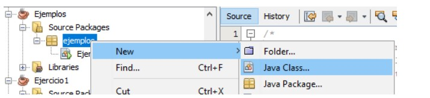
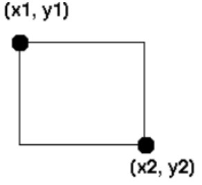
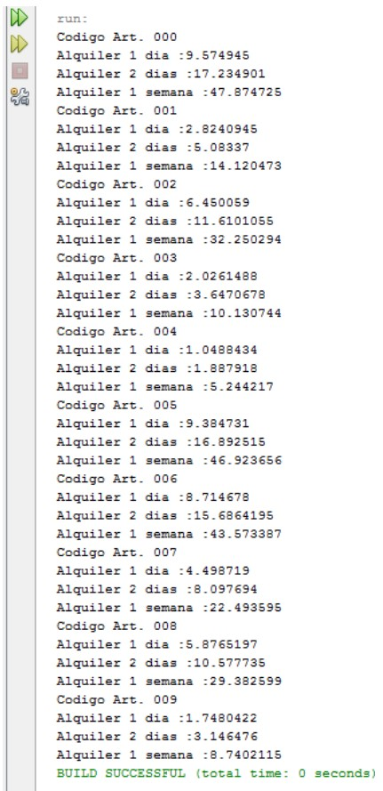

# 9. Exemples

## 9.1. Exemple 1

En aquest exemple implementarem la classe Articles. Aquesta classe representa cada objecte amb els següents atributs: codi_article, titol, format i preu_alquiler. També defineix tres mètodes que permeten calcular, respectivament, el preu de lloguer d'un dia, de dos dies i una setmana. El primer que necessitarem, i això ho farem per cada classe que necessitem en tots els exemples, serà crear-nos una nova classe a Java. Per a això punxarem amb el botó dret sobre el paquet on anem a tindre les classes i després en NEW > Java Class. Crearem una classe anomenada Article.



```java
public class Article{
  //Atributs de la classe
  String  cod;
  String titol;
  String format;
  float preu_alquiler;

  //Mètodes de la classe
  float preu1(){
    return preu_alquiler;
  }

  float preu2(){
    float preu_total;

    preu_total = preu_alquiler * 1.80f;

    return preu_total;
  }

  float preu_setmana(){
    float preu_total;

    preu_total = preu_alquiler * 5;

    return preu_total;
  }
}
```

El mètode precio1 retorna el valor del preu de lloguer de l'article. El mètode precio2 calcula el preu de lloguer de dos dies fent un descompte del 20% (per això es multiplica per 1,8). Per últim el mètode precio_semana calcula el preu d'una setmana multiplicant per 5 el preu de lloguer.

Crearem una classe nova anomenada Exemples, amb la funció public static void main, on anem a instanciar (crear) objectes de Article i utilitzar-los. Amb l'operador new crearem una instància de la classe Article. Com de moment la classe no té constructors s'invocarà al constructor per defecte de la classe.

**<u>RECORDA</u>**: Quan instanciem una classe estem creant un objecte d'aquesta classe.

```java
public class Exemples{
  public static void main(String[] args){
    //Creem dos articles
    Article article1 = new Article();
    Article article2 = new Article();

    //Li donem valors als seus atributs
    article1.cos = "001";
    article1.titol = "Títol1";
    article1.format = "DVD";
    article1.preu_alquiler = 2.50f;

    article1.cos = "002";
    article1.titol = "Títol2";
    article1.format = "DVD";
    article1.preu_alquiler = 3;

    System.out.println("Alquiler Art. " + article1.cod + ", 1 dia: " + article1.preu1());
    System.out.println("Alquiler Art. " + article1.cod + ", 2 dies: " + article1.preu2());
    System.out.println("Alquiler Art. " + article1.cod + ", 1 setmana: " + article1.preu_setmana());
    System.out.println("Alquiler Art. " + article2.cod + ", 1 dia: " + article2.preu1());
    System.out.println("Alquiler Art. " + article2.cod + ", 2 dies: " + article2.preu2());
    System.out.println("Alquiler Art. " + article2.cod + ", 1 setmana: " + article2.preu_setmana());
  }
}
```

I l'eixida:

```plaintext
Alquiler Art. 001, 1 dia: 2.5
Alquiler Art. 001, 2 dies: 4.5
Alquiler Art. 001, 1 setmana: 12.5
Alquiler Art. 002, 1 dia: 3.0
Alquiler Art. 002, 2 dies: 5.3999996
Alquiler Art. 002, 1 setmana: 15.0
```

## 9.2. Exemple 2

En aquest exemple anem a implementar la classe Cuadrado, que representa quadrats mitjançant dues coordenades 2D, i defineix tres mètodes que permeten calcular, respectivament, la diagonal, el perímetre i l'àrea.

El criteri de representació pren les coordenades horitzontals (x) creixents d'esquerra a dreta, i les verticals (y) creixents de dalt a baix.



El codi de Quadrat.java seria:

```java
public class Quadrat{
  //Atributs
  double x1, y1, x2, y2;

  //Mètodes
  double calcularDiagonal(){
    return Math.sqrt((x2-x1)*(x2-x1)+(y2-y1)*(y2-y1));
  }

  double calcularPerimetre(){
    double diagonal = calcularDiagonal();
    double costat = diagonal/Math.sqrt(2);

    return (4*costat);
  }

  double calcularArea(){
    double diagonal = calcularDiagonal();

    return (0.5*diagonal*diagonal)
  }
}

```

El codi de Exemples.java seria:

```java
public class Exemples{
  public static void main(String[] args){
    //Creem dos quadrats
    Quadrat c1 = new Quadrat();
    Quadrat c2 = new Quadrat();

    //Els donem valors
    c1.x1 = 2; c1.y1 = 2; c1.x2 = 4; c1.y2 = 4;
    c2.x1 = 1; c2.y1 = 1; c2.x2 = 5; c2.y2 = 5;

    System.out.println("El perímetre del quadrat 1 és: " + c1.calcularPerimetre());
    System.out.println("L'àrea del quadrat 1 és: " + c1.calcularArea());
    System.out.println("El perímetre del quadrat 2 és: " + c2.calcularPerimetre());
    System.out.println("L'àrea del quadrat 2 és: " + c2.calcularArea());
  }
}
```

I l'eixida:

```plaintext
El perímetre del quadrat 1 és: 8.0
L'àrea del quadrat 1 és: 4.00000000000001
El perímetre del quadrat 2 és: 16.0
L'àrea del quadrat 2 és: 16.00000000000004
```

## 9.3. Exemple 3

En aquest exemple aplicarem el principi de encapsulament fent private els atributs de la classe i public els mètodes. Per a això modificarem la classe Article de l'Exemple 1.

Però ara no podrem llegir ni modificar els atributs de la classe des de fora d'ella (perquè són private). Així que definirem mètodes que ens permeten fer-ho:

- Crearem mètodes public (un per atribut) que ens retorne el valor de cada atribut. A això se'n diu mètodes **get** o **getters** (de l'anglés agafar).
- De la mateixa manera, mètodes que ens permeten modificar el valor dels atributs. A això se'n diu mètodes **set** o **setters** (de l'anglés establir). En l'exemple es diu modificaValors i permet canviar tots els valors en una sola crida.

El codi de Article.java seria:

```java
public class Article{
  //Atributs de la classe
  private String  cod;
  private String titol;
  private String format;
  private float preu_alquiler;

  //Mètodes de la classe
  public float preu1(){
    return preu_alquiler;
  }

  public float preu2(){
    float preu_total;

    preu_total = preu_alquiler * 1.80f;

    return preu_total;
  }

  public float preu_setmana(){
    float preu_total;

    preu_total = preu_alquiler * 5;

    return preu_total;
  }

  public void modificaValors(String cod_p, String titol_p, String format_p, float preu_p){
    cod = cod_p;
    titol = titol_p;
    format = format_p;
    preu_alquiler = preu_p;
  }

  public String getCod(){
    return cod;
  }

  public String getTitol(){
    return titol;
  }

  public String getFormat(){
    return format;
  }

  public float getPreu_alquiler(){
    return preu_alquiler;
  }
}
```

El codi de Exemples.java seria:

```java
public class Exemples{
  public static void main(String[] args){
    //Creem dos articles
    Article article1 = new Article();
    Article article2 = new Article();

    //Li donem valors als seus atributs
    article1.modificaValors("001","Titol1","DVD",2.5f);
    article2.modificaValors("002","Titol2","DVD",3f);

    System.out.println("Alquiler Art. " + article1.getCod() + ", 1 dia: " + article1.preu1());
    System.out.println("Alquiler Art. " + article1.getCod() + ", 2 dies: " + article1.preu2());
    System.out.println("Alquiler Art. " + article1.getCod() + ", 1 setmana: " + article1.preu_setmana());
    System.out.println("Alquiler Art. " + article2.getCod() + ", 1 dia: " + article2.preu1());
    System.out.println("Alquiler Art. " + article2.getCod() + ", 2 dies: " + article2.preu2());
    System.out.println("Alquiler Art. " + article2.getCod() + ", 1 setmana: " + article2.preu_setmana());
  }
}
```

I l'eixida:

```plaintext
Alquiler Art. 001, 1 dia: 2.5
Alquiler Art. 001, 2 dies: 4.5
Alquiler Art. 001, 1 setmana: 12.5
Alquiler Art. 002, 1 dia: 3.0
Alquiler Art. 002, 2 dies: 5.3999996
Alquiler Art. 002, 1 setmana: 15.0
```

## 9.4. Exemple 4

En aquest exemple veurem com crear un constructor de classe. Per a això ens basarem en la classe Article creada anteriorment i li afegirem el constructor.

El codi de Article.java:

```java
public class Article{
  //Atributs de la classe
  private String  cod;
  private String titol;
  private String format;
  private float preu_alquiler;

  //Constructor de la classe
  public Article(String cod, String titol, String format, float preu_alquiler){
    //amb this estem accedint a l'objecte de la classe
    this.cod = cod;
    this.titol = titol;
    this.format = format;
    this.preu_alquiler = preu_alquiler;
  }

  //Mètodes de la classe
  public float preu1(){
    return preu_alquiler;
  }

  public float preu2(){
    float preu_total;

    preu_total = preu_alquiler * 1.80f;

    return preu_total;
  }

  public float preu_setmana(){
    float preu_total;

    preu_total = preu_alquiler * 5;

    return preu_total;
  }

  public void modificaValors(String cod_p, String titol_p, String format_p, float preu_p){
    cod = cod_p;
    titol = titol_p;
    format = format_p;
    preu_alquiler = preu_p;
  }

  public String getCod(){
    return cod;
  }

  public String getTitol(){
    return titol;
  }

  public String getFormat(){
    return format;
  }

  public float getPreu_alquiler(){
    return preu_alquiler;
  }
}
```

Ara en Exemples.java utilitzem el constructor (al instanciar l'objecte amb new). Això permet instanciar l'objecte i definir atributs en una sola instrucció.

```java
public class Exemples{
  public static void main(String[] args){
    //Creem dos articles
    Article article1 = new Article("001","Titol1","DVD",2.5f);
    Article article2 = new Article("002","Titol2","DVD",3f);

    System.out.println("Alquiler Art. " + article1.getCod() + ", 1 dia: " + article1.preu1());
    System.out.println("Alquiler Art. " + article1.getCod() + ", 2 dies: " + article1.preu2());
    System.out.println("Alquiler Art. " + article1.getCod() + ", 1 setmana: " + article1.preu_setmana());
    System.out.println("Alquiler Art. " + article2.getCod() + ", 1 dia: " + article2.preu1());
    System.out.println("Alquiler Art. " + article2.getCod() + ", 2 dies: " + article2.preu2());
    System.out.println("Alquiler Art. " + article2.getCod() + ", 1 setmana: " + article2.preu_setmana());
  }
}
```

I l'eixida:

```plaintext
Alquiler Art. 001, 1 dia: 2.5
Alquiler Art. 001, 2 dies: 4.5
Alquiler Art. 001, 1 setmana: 12.5
Alquiler Art. 002, 1 dia: 3.0
Alquiler Art. 002, 2 dies: 5.3999996
Alquiler Art. 002, 1 setmana: 15.0
```

## 9.5. Exemple 5

Per a il·lustrar l'ús dels qualificadors **final** i **static** dins de la nostra classe Article, definirem tres atributs principals:

- La constant IVA.
- Un atribut compartit que comptabilitzarà el nombre d'instàncies que s'hagen definit fins llavors.
- Un atribut constant String, diferent per a cada objecte, que permeta identificar-los.

Definirem IVA com static i final, podrem accedir al seu valor mitjançant l'expressió Article.IVA, sense necessitat d'haver creat cap objecte de la classe Article:

```java
public static final double IVA = 0.16;
```

L'atribut privat amb el número d'instància, en realitat, es tracta d'una variable global accessible per a tots els objectes de tipus Article:

```java
private static int numero = 0;
```

I finalment, l'identificador constant de cada objecte s'indica amb un especificador final en la seua descripció.

```java
final String identificador;
```

Es deixa com a exercici proposat fer aquests canvis i provar-ho.

## 9.6. Exemple 6

En aquest exemple crearem un array (vector) que continga deu objectes de tipus Article. Els instanciarem tots amb noms genèrics, consecutius i preus aleatoris.

Primer creem un vector de Articles anomenat elsMeusArticles (és un array de referències a objectes Article). Després instànciarem els 10 objectes, guardant cadascun dels objectes referenciats.

La classe Article no es veuria modificada. El codi d'Exemples quedaria així:

```java
public class Exemples{
  public static void main(String[] args){
    //Definim el vector d'Articles de tamany 10
    Articles[] elsMeusArticles = new Articles[10];
    int cont;
    
    //Per a cada element del vector creem l'objecte Article
    for(cont = 0; cont < elsMeusArticles.length; cont++)
      elsMeusArticles[cont] = new Articles("00"+cont, "Article "+cont, (float)(Math.random()*10))

    for(cont = 0; cont < elsMeusArticles.length; cont++>){
      System.out.println("Codi Art. " + elsMeusArticles[cont].getCod());
      System.out.println("Alquiler 1 dia: " + elsMeusArticles[cont].preu1());
      System.out.println("Alquiler 2 dies: " + elsMeusArticles[cont].preu2());
      System.out.println("Alquiler 1 setmana: " + elsMeusArticles[cont].preu_setmana());
    }    
  }
}
```

I l'eixida seria



## 9.7. Exemples d'ampliació

## Exemple d'ampliació 1

Programa que crea gossos i descriu el seu comportament.

1. **Classe Gos**

```java
package UF08_Exemple01;
/**
* UF08 Exemple 01: Classe Gos
*/
public class Gos {
 
    // Atributs
    String color, raça, sexe;
    int edat;
    double pes;

    // Mètode constructor: sempre té el mateix nom que la classe
    Gos (String s) {
        this.sexe = s;
    }
    // Mètodes getter
    String diMeSexe() {
        return this.sexe;
    }

    // Mètodes:
    // El gos lladra
    void lladra() {
        System.out.println("Bof! Bof!");
    }

    // El gos meneja la cua
    void cua() {
        System.out.println("\\ / \\ / \\ /");
    }
    // Li donem mejar al gos i ens diu si li agrada
    void menjar(String menjar) {
        if (menjar.equals("os")) {
            System.out.println("Hmmmm, gràcies");
        } else {
            System.out.println("Ho sent, a mi dona'm ossos");
        }
    }

    // Si troba un contrincant es bregarà segons el sexe
    void bregaAmb(Gos contrincant) {
        if (this.sexe.equals("femella")) {
            System.out.println("No m'interessa bregar-me");
        } else {
            if (contrincant.diMeSexe().equals("femella")) {
                System.out.println("No em bregue amb gosses");
            } else {
                System.out.println("Vine cap ací que t'ho vaig a explicar!!!");
            }
        }
    }
}
```

2. **Programa Principal**

```java
package UF08_Exemple01;
/**
* UF08 Exemple 01: Programa que crea gossos i descriu el seu comportament
*/
public class ProgramaGossos {
    public static void main(String[] args) {
        Gos snoopy = new Gos("mascle");
        System.out.println("- ¡Hola gos!");
        snoopy.lladra();
        System.out.println("- Tin una coca");
        snoopy.menjar("coca de segí");
        System.out.println("- Tin un os, a veure si açò t'agrada");
        snoopy.menjar("os");
        Gos scooby = new Gos("mascle");
        System.out.println("- Scooby, tin sopeta de verdures");
        scooby.menjar("sopa de verdures");
        Gos laika = new Gos("femella");
        System.out.println("- Laika,¿estàs contenta?");
        laika.cua();
        System.out.println("- A veure com lladreu");
        snoopy.lladra();
        scooby.lladra();
        laika.lladra();
        System.out.println("- A veure com us porteu entre vosaltres");
        System.out.println("Snoopy li diu a Laika: "); 
        snoopy.bregaAmb(laika);
        System.out.println("Laika li diu a Scooby: "); 
        laika.bregaAmb(scooby);
        System.out.println("Scooby li diu a Snoopy: "); 
        scooby.bregaAmb(snoopy);
    } 
}
```

## Exemple d'ampliació 2

Programa que gestiona contenidors de líquid i permet passar líquid d'un al altre tenint en compte la capacitat lliure del segon contenidor.
La classe contenidor tindrà dos atributs: capacitat i contingut.

Cada cub es podrà crear amb una capacitat.

Tindrem mètodes setter per a plenar el contenidor(plenaContenidor), actualitzar el contingut del contenidor amb un número de litres (actualitzaContenidor) o buidar completament el contenidor (buidaContenidor) i getter que ens donarà els litres de capacitat i contingut (mostraCapacita i mostra Contingut).

Tindrem un mètode per a passar litres d’un contenidor a altre (passaContingut) de forma que si cap es passa tot i sinó es passa sols el que es puga fins que quede ple el segon.

Finalment, tindrem un mètode que dibuixe els contenidors amb el seu contingut (dibuixaContenidor). Podem utilitzar una funció que cridarem de forma repetitiva per a mostrar els contenidors.

1. **Classe Contenidor**

```java
package UF08_Exemple02;
/**
* UF08 Exemple 02: Classe Contenidor
*/
public class Contenidor {
    // Atributs
    int capacitat; // capacitat màxima en litres del contenidor
    int contingut; // contingut actual en litres

    // Mètodes 
    // Constructor
    Contenidor (int par_capacitat) {
        this.capacitat = par_capacitat;
    }
    // Mètodes getter
    int mostraCapacitat() {
        return this.capacitat;
    }
    int mostraContingut() {
        return this.contingut;
    }
    // Mètode setter
    void actualitzaContingut(int litres) {
        this.contingut = litres;
    }
    // Buidar el contenidor
    void buidaContenidor () {
        this.contingut = 0;
    }
    // Plenar el contenidor al màxim de capacitat
    void plenaContenidor () {
        this.contingut = this.capacitat;
    }

    // Passa els litres que pot d'un contenidor a altre
    void passaContingut (Contenidor receptor) {
        int enCaben = receptor.mostraCapacitat() - receptor.mostraContingut();
        if (enCaben > 0) {
            // Si cap tot el contingut orige en el receptor el passem i buidem el contenidor orige
            if (this.contingut <= enCaben) {
                receptor.actualitzaContingut (receptor.mostraContingut() + this.contingut); 
                this.buidaContenidor();

            // Si sols cap una part, plenem el receptor complet i descomtem el que hem passat en el contenidor orige
            } else {
                receptor.plenaContenidor();
                this.contingut -= enCaben;
            }
        }
    }

    // Mètode per a dibuixar el contenidor
    void dibuixaContenidor () {
        System.out.println();
        for (int i = this.capacitat; i > 0; i--) {
            if (i>this.contingut){
                System.out.println("|| ||");
            } else {
                System.out.println("||~~~~~~||");
            }
        }
        System.out.println("==========\n");
    }
}
```

2. **Programa Principal**

```java
package UF08_Exemple02;
import java.util.Scanner;
/**
* UF08 Exemple 02: Programa 
*/
public class ProgramaContenidor {
    public static void main(String[] args) {
        // Creem dos contenidors
        Contenidor diposit1 = new Contenidor (4);
        Contenidor diposit2 = new Contenidor (7);

        // Mostrem l'estat inicial dels contenidors
        mostremContenidors (diposit1, diposit2, 1);

        // Plenem el primer contenidor
        System.out.println("Plenem el Diposit 1.");
        diposit1.plenaContenidor ();
        // Mostrem l'estat dels contenidors
        mostremContenidors (diposit1, diposit2, 2);

        // Passem el contingut del Diposit1 al Diposit2 
        System.out.println("Passem el Diposit 1 al Diposit 2.");
        diposit1.passaContingut(diposit2);

        // Mostrem l'estat dels contenidors
        mostremContenidors (diposit1, diposit2, 2);

        // Tornem a plenem el primer contenidor
        System.out.println("Tornem a plenem el Diposit 1.");
        diposit1.plenaContenidor ();

        // Mostrem l'estat dels contenidors
        mostremContenidors (diposit1, diposit2, 2);

        // Tornem a passar el contingut del Diposit1 al Diposit2, però ara ja no cap tot 
        System.out.println("Tornem a passar el Diposit 1 al Diposit 2.");
        diposit1.passaContingut(diposit2);

        // Mostrem l'estat dels contenidors
        mostremContenidors (diposit1, diposit2, 2); 
    }

    public static void mostremContenidors (Contenidor diposit1, Contenidor diposit2, int missatge){
        Scanner intro = new Scanner (System.in);

        if (missatge==1){
            System.out.println("El Diposit 1 té una capacitat de " + diposit1.mostraCapacitat() + " litres.");
        } else {
            System.out.println("El Diposit 1 té un contingut de " + diposit1.mostraContingut() + " litres."); 
        }
        diposit1.dibuixaContenidor();

        if (missatge==1){
            System.out.println("El Diposit 2 té una capacitat de " + diposit2.mostraCapacitat() + " litres.");
        } else {
            System.out.println("El Diposit 2 té un contingut de " + diposit2.mostraContingut() + " litres."); 
        }
        diposit2.dibuixaContenidor();

        System.out.println ("Polsa INTRO per continuar.");
        intro.nextLine();
    }
}
```

**ENCAPSULAMENT**

- Realitza proves sobre la visibilitat dels atributs capacitat i contingut:
  - Tal i com estan definits, es pot accedir des de una altra classe dins del mateix paquet? La resposta és sí, de fet si en el programa principal substituïm diposit1.mostraCapacitat() per diposit1.capacitat no dona cap problema.
  - I si passem el programa principal a un altre paquet, continuarem podent accedir de la forma indicada en el punt anterior? No, en aquest cas necessitarem que estiguen declarades com a public. Fes la prova.
  - Fes ara la prova (independent de l’anterior) i declara aquests atributs com private, què li passa al programa principal si intentes fer el canvi del punt primer?.
